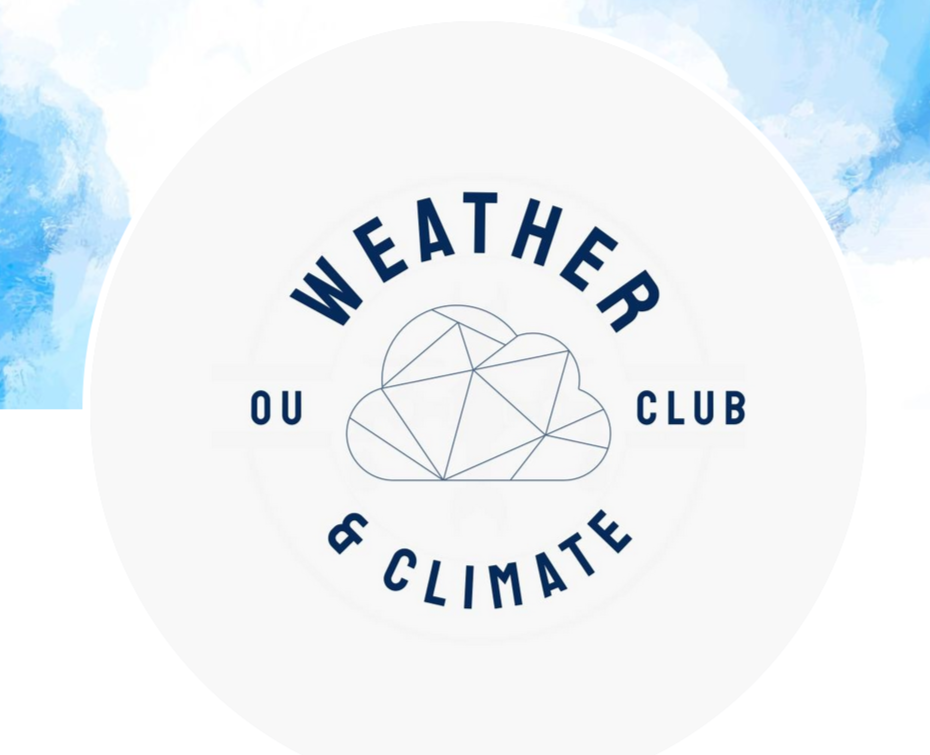

 
# Welcome to the Open University Weather & Climate Club 👋

We are a friendly group offering support and opportunities to anyone curious about developing their interest or career in weather and climate.

Whether you are a beginner or more experienced coder, we want to help people find coding study buddies and become part of a collaborative coding community over weather and climate.

We are a new club and are busy setting up areas for beginners, portfolio project ideas and how to use open source meteorological data sets.

We have made a start already, with much more to follow! - so if you would like to support our initiatives, or follow what's available as we grow, you can find out how to join us below 👇

 
 [Find our links](https://linktr.ee/ouweatherandclimateclub)

***
### Explore our repos by topic label!

<mark>ou-club-learning</mark> &nbsp; &nbsp; &nbsp; &nbsp; &nbsp; &nbsp; &nbsp; &nbsp; &nbsp; &nbsp; &nbsp; &nbsp; &nbsp; &nbsp; *for collaborative learning*

<mark>ou-club-activities</mark> &nbsp; &nbsp; &nbsp; &nbsp; &nbsp; &nbsp; &nbsp; &nbsp; &nbsp; &nbsp; &nbsp; &nbsp; &nbsp; &nbsp; *for club-led activites*

<mark>members-inspiration-board</mark> &nbsp; &nbsp; &nbsp; &nbsp; &nbsp; &nbsp; *for member-shared repos*

<mark>members-seeking-collaborators</mark> &nbsp; &nbsp; *for finding collaborators*

***
### Sharing repos as a member:

Copies of repos showcased on our inspiration board will be kept on public read-only access with branch protection rules. The original repo in your personal account will remain unaffected. 

Collaborators can be added on request at the discretion of the member who shared the repo 🤝

 We would love to help you and your projects reach a wider audience - so if you would like to get involved, do get in touch!

<!--

**Here are some ideas to get you started:**

🙋‍♀️ A short introduction - what is your organization all about?
🌈 Contribution guidelines - how can the community get involved?
👩‍💻 Useful resources - where can the community find your docs? Is there anything else the community should know?
🍿 Fun facts - what does your team eat for breakfast?
🧙 Remember, you can do mighty things with the power of [Markdown](https://docs.github.com/github/writing-on-github/getting-started-with-writing-and-formatting-on-github/basic-writing-and-formatting-syntax)
-->
